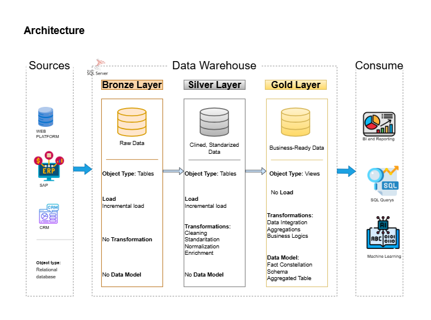
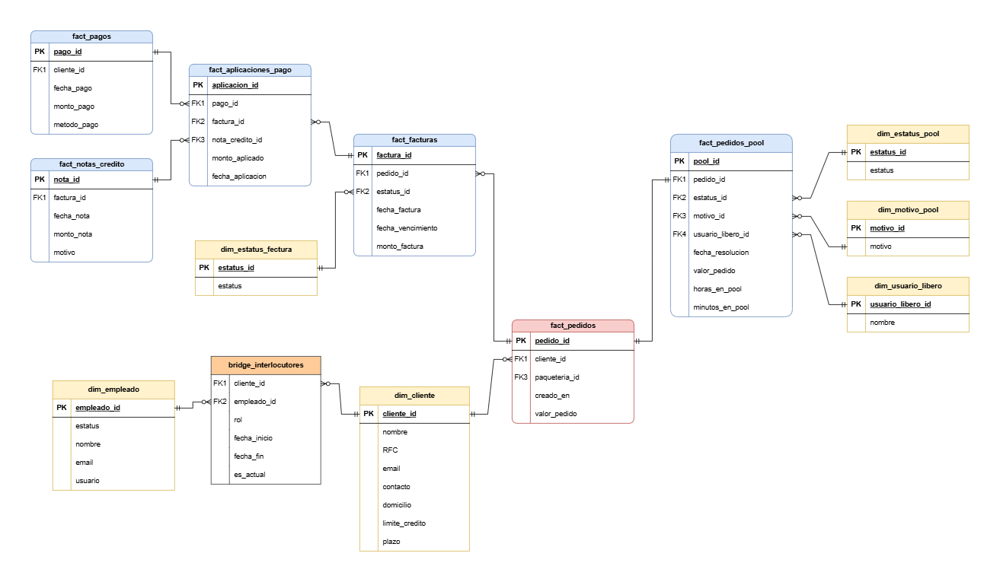

# Order-to-Cash Data Warehouse

## 📖 Overview

This project implements a modern **Data Warehouse for Order-to-Cash (O2C) analytics**, integrating operational data from multiple enterprise systems including SAP ERP, Odoo CRM, and internal logistics systems.

The objective of this platform is to provide a **single source of truth for commercial and financial analytics**, enabling the business to analyze the complete lifecycle of a customer order — from order creation to invoicing, payment, and credit adjustments.

The solution follows a **Medallion Architecture (Bronze → Silver → Analytics → Gold)** to ensure data quality, scalability, and maintainability.

Data is ingested from operational systems, standardized and cleansed in intermediate layers, and finally modeled into a **Star Schema optimized for BI tools such as Power BI**.

The final Gold layer exposes **business-ready fact and dimension tables**, enabling fast and reliable reporting for finance, sales, and operations teams.

---

# 🏗️ Architecture

The project follows a **Medallion Architecture**, a layered data design pattern widely used in modern data platforms.

Each layer progressively improves data quality and structure.

<p align="center">
  
</p>

1. Bronze Layer: Stores raw data as-is from the source systems. Data is ingested from CSV Files into SQL Server Database.
2. Silver Layer: This layer includes data cleansing, standardization, and normalization processes to prepare data for analysis.
3. Gold Layer: Houses business-ready data modeled into a star schema required for reporting and analytics.

---

# Data Sources

The data warehouse integrates information from multiple operational systems.

| System   | Description                                                           |
| -------- | --------------------------------------------------------------------- |
| SAP ERP  | Financial data including invoices, payments, and accounting documents |
| Odoo CRM | Customer master data and commercial relationships                     |
| CIOSACOM | Internal operational system for order and logistics management        |

These systems provide data required to analyze the **complete Order-to-Cash lifecycle**.

---

# Star Schema

The Gold layer implements a dimensional model optimized for analytics.



### Fact Tables

* `fact_pedidos`
* `fact_facturas`
* `fact_pagos`
* `fact_aplicaciones_pago`
* `fact_notas_credito`
* `fact_pedidos_pool`

### Dimension Tables

* `dim_cliente`
* `dim_empleado`
* `dim_estatus_factura`
* `dim_estatus_pool`
* `dim_motivo_pool`
* `dim_usuario_libero`
* `dim_paqueteria`

### Bridge Tables

* `bridge_interlocutores`

This bridge table tracks the historical relationship between customers and employees using **Slowly Changing Dimension Type 2 (SCD2)** logic.

---

# ETL Pipeline

The ETL process is implemented using SQL stored procedures and runs in the following order:

1. Load Bronze layer (raw ingestion)
2. Load Silver layer (data cleansing)
4. Expose Gold layer views for reporting

```
Bronze Load
     ↓
Silver Load
     ↓
Gold Views
     ↓
Power BI / Reporting
```

---

# 📂 Repository Structure

```
data-warehouse-project/

│
├── scripts/                              # SQL scripts for ETL and transformations
│   ├── bronze                            # Scripts for extracting and loading raw data
│   ├── silver                            # Scripts for cleaning and transforming data
│   ├── gold                              # Scripts for creating analytical models
│
├── docs/
│   ├── data_catalog.md                   # Catalog of datasets, including field descriptions and metadata
│   ├── architecture_dwh.drawio           # Draw.io file shows the project's architecture
│   ├── star_schema.drawio                # Draw.io file for data models (star schema)
│ 
├── test/                                 # Test scripts and quality files
│   ├── quality_chacks_silver             
│
│
└── README.md                             # Project overview and instructions
```

---

# Tools and Technologies

This project uses the following technologies:

* SQL Server
* T-SQL (Stored Procedures and Views)
* Data Warehouse Modeling
* Medallion Architecture
* Slowly Changing Dimensions (SCD)
* Star Schema Design

---

# Use Cases

This data warehouse enables several analytical capabilities:

* Sales performance analysis
* Customer revenue tracking
* Order-to-cash lifecycle analysis
* Invoice and payment reconciliation
* Operational monitoring of order exceptions
* Customer–employee relationship analysis


